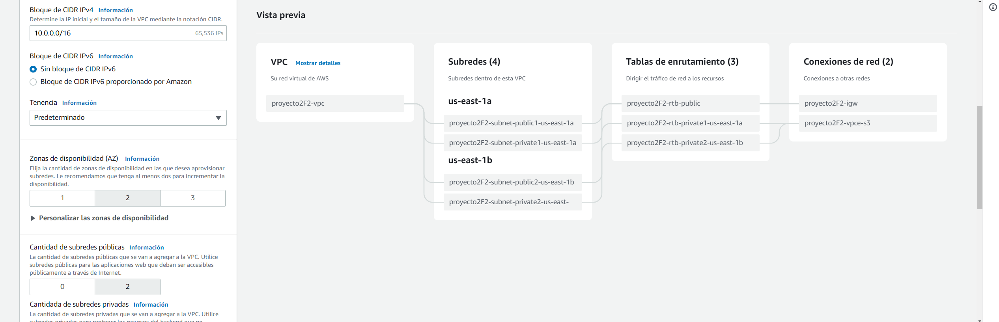
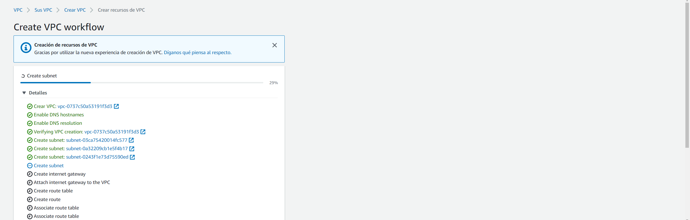
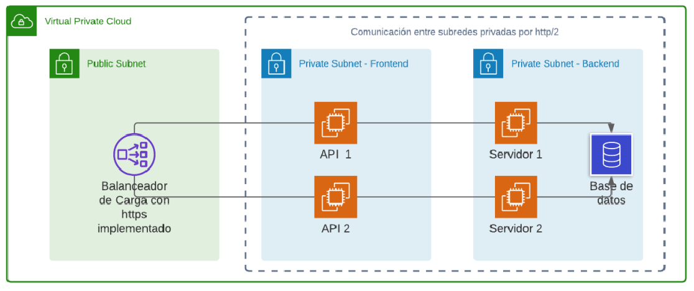

# REDES2_1S2022_GRUPO18

### Integrantes Proyecto Fase 2
 

|   | NOMBRE                                      | CARNE     |
| - | ------------------------------------------- | --------- |
| 1 | Santiago Gilberto Antonio Rivadeneira Ruano | 201313722 |
| 2 | Edwin Alfredo Lopez Gomez                   | 201314007 |
| 3 | Javier Oswaldo Miron Cifuentes              | 201602694 |

---
### Definición del problema
El país de Ucron ahora cuenta con una página para darse a conocer al mundo;
sin embargo, aún no cuentan con la seguridad para prevenir futuros ataques
cibernéticos y el servicio no cumple con la disponibilidad adecuada para cubrir la
demanda de peticiones realizadas.
Por ello le solicita nuevamente que realice la configuración necesaria dentro de
la nube para salvaguardar la información con la que cuentan dentro de su
gobierno y restringir el acceso a la misma utilizando los servicios que proporciona
AWS

---
### Configuracion VPC
Se utilizaron VPC para poder configurar todas las subredes, la NAT GATEWAY y mas.

---
### Topologia

---
### Instancias
Se crearon un total de 6 instancias, estas fueron 2 para el manejo de los frontend las cuales se encuentran en una misma subred privada destinada al frontend, las siguientes 3 se encuentran en la subred privada dedicada al backend, por ultimo se creo una instancia publica, la cual permite realizar la conexion a las redes privadas.

---
### Load Balancer
Para distribuir el trafico HTTP se utilizo un Load Balancer, el cual no permite distribuir las solicitudes de los usuarios a los diferentes frontend.

---
### Security Group
Se crearon multiples Security Group para mantener la seguridad activa de los puertos, esto para permitir el trafico de datos en puertos especificos para el uso de la aplicacion, esto con el fin de prevenir ataques o rupturas en la seguridad del sistema.

---
### Target Group
El Target Group fue implementado dentro del Load Balancer, este nos permite indicarle al Load Balancer hacia que instancias debe dirigir el trafico de datos, en este se configuraron las instancias de los frontend.

