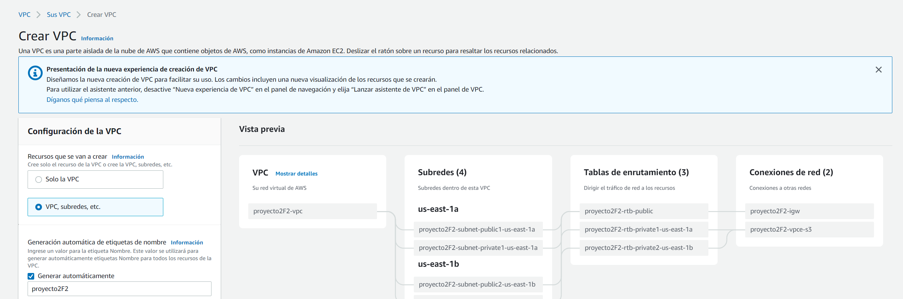
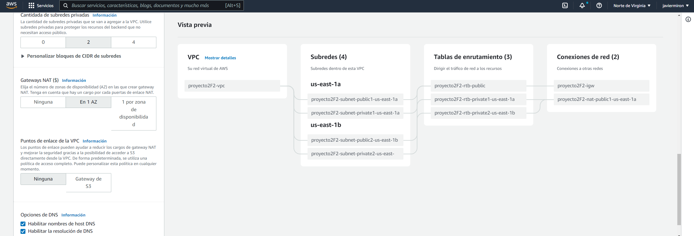
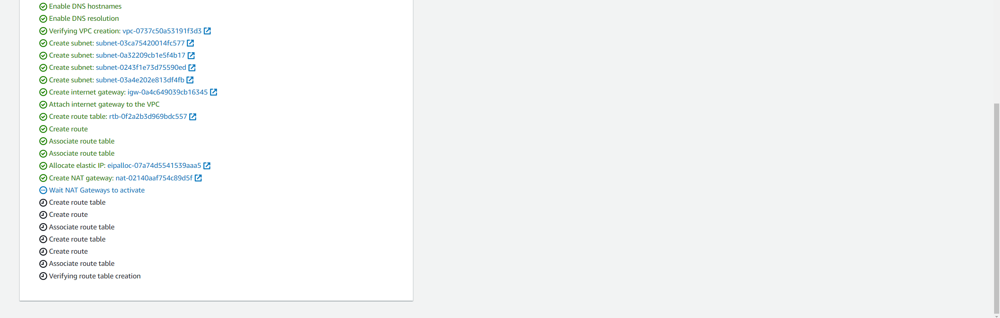

# REDES2_1S2022_GRUPO18

### Integrantes Proyecto Fase 2
 

|   | NOMBRE                                      | CARNE     |
| - | ------------------------------------------- | --------- |
| 1 | Santiago Gilberto Antonio Rivadeneira Ruano | 201313722 |
| 2 | Edwin Alfredo Lopez Gomez                   | 201314007 |
| 3 | Javier Oswaldo Miron Cifuentes              | 201602694 |

---
### Definición del problema
El país de Ucron ahora cuenta con una página para darse a conocer al mundo;
sin embargo, aún no cuentan con la seguridad para prevenir futuros ataques
cibernéticos y el servicio no cumple con la disponibilidad adecuada para cubrir la
demanda de peticiones realizadas.
Por ello le solicita nuevamente que realice la configuración necesaria dentro de
la nube para salvaguardar la información con la que cuentan dentro de su
gobierno y restringir el acceso a la misma utilizando los servicios que proporciona
AWS

---
### Configuracion VPC

---
### Topologia

